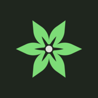

    </img>

  <h1 align="center" style="font-size: 30px;">DitmeNavi</h1>

My copypasta website, version 2

---

Current changelog:

- Auto scroll to each section
  
- Copy text
  
- Dark mode & auto change to Dark mode based on local time
  
- Faster loading time
  
- Emoji copypasta(EmojiPasta) generator
  
- Copypasta submission
  
- Overall design remake
  

And much more but not yet...

***Note: Copypasta submitting isn't available in this version.***

This work is licensed under the Creative Commons Attribution-NonCommercial-ShareAlike 4.0 International License. To view a copy of this license, visit http://creativecommons.org/licenses/by-nc-sa/4.0/ or send a letter to Creative Commons, PO Box 1866, Mountain View, CA 94042, USA.
